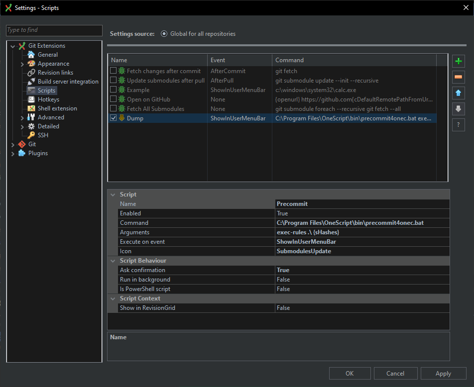
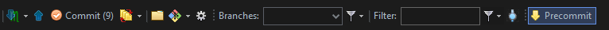

# Команда `exec-rules`

Команда предназначена для принудительного выполнения указанных сценариев в выбранном репозитории.

### Параметры команды

```
exec-rules -source-dir <Каталоги исходных файлов> -rules <Применяемые сценарии> -cfg-file <Файл настроек> <КаталогРепозитория> <Коммит1> <Коммит2>
```

Описание параметров:
- КаталогРепозитория - обязательный параметр, должен содержать абсолютный или относительный путь к каталогу репозитория, для файлов которого будут выполняться сценарии прекоммита;
- Коммит1, Коммит2 - необязательные параметры, если указаны, сценарии будут выполнены не для всех исходных файлов, а только для тех, которые были изменены между двумя коммитами. В качестве значения следует передавать хэш коммита. Если указано два хэша, будут составлен список измененных файлов между ними, если один, то он должен иметь двух родителей (как в случае коммита при merge-реквесте), иначе будет вызвано исключение;
- Каталоги исходных файлов - необязательный параметр, поддерживает перечисление через запятую относительных путей к каталогам внутри каталога репозитория, в которых расположены исходные файлы, для которых будут выполнять сценарии прекоммита. Значение по-умолчанию - "src";
- Применяемые сценарии - необязательный параметр, содержащий список сценариев, перечисленных через запятую, выполняемый для обрабатываемых файлов. Если не указан, выполняются все сценарии прекоммита;
- Файл настроек - необязательный параметр, путь к файлу настроек прекоммита. Если не указан, используется файл `v8config.json` репозитория или глобальные настройки, если файл в репозитории отсутствует.

### Примеры

1. Команда:
   
    ```shell
    precommit4onec exec-rules "C:\МойРепозиторий" -source-dir "ПапкаИсходныхФайловSrc" -rules "ВставкаКопирайтов,ПроверкаНецензурныхСлов"
    ```

    Для всех файлов в каталоге `C:\МойРепозиторий\ПапкаИсходныхФайловSrc` будут выполнены сценарии: `ВставкаКопирайтов`, `ПроверкаНецензурныхСлов`.

2. Команда:
   
    ```shell
    precommit4onec exec-rules "C:\МойРепозиторий" 454474a414494f4b77c484939173e1d44678c96a 937f5cf1ebdda2eaadb1aa169cf066583f2763db
    ```

    Для файлов в каталоге `C:\МойРепозиторий\src`, измененных между указанными коммитами, будут выполнены все сценарии прекоммита. Если файлы находятся вне каталога `src`, они будут проигнорированы.

### Вызов команды в Git Extensions

Возможности [Git Extension](https://gitextensions.github.io/) позволяют подключать пользовательские скрипты для работы с данными. Например, следующая настройка в разделе `Git Extensions\Scripts`:



позволяет добавить на командную панель кнопку запуска прекоммита для выбранных в дереве коммитов:



В настройках указывается:
- Command - путь к скрипту запуска прекоммита;
- Arguments - параметры запуска по шаблону, описанному выше. Вместо `{sHashes}` Git Extensions подставит разделенные пробелом хэши выделенных в дереве коммитов.
